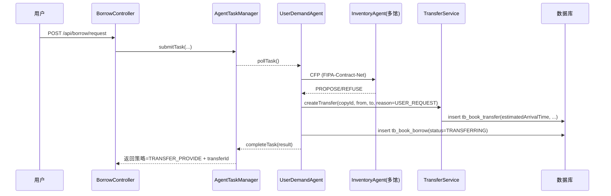
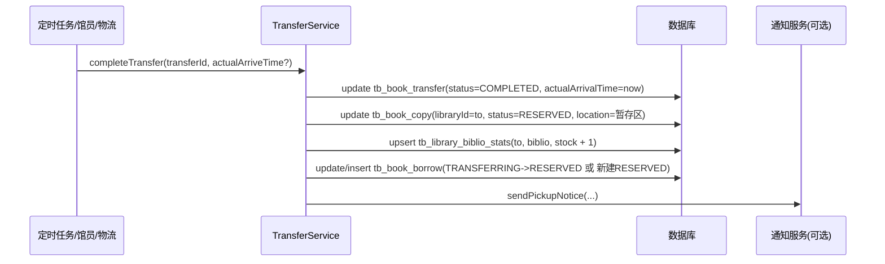
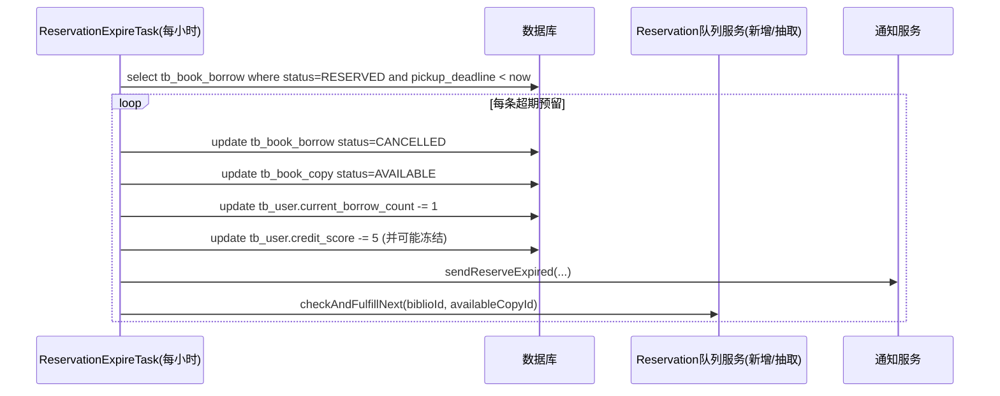
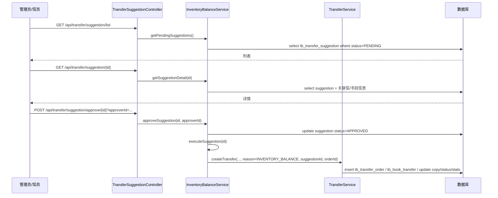

# 后续开发方向规划（多智能体图书馆调度系统）

> 目标：在不引入复杂企业中间件（如 Redis、强事件总线等）的前提下，把“借书-调拨-到货-预留-取书-还书-预约兑现”主链路做成**一致、可解释、可测试**的闭环；同时补齐库存平衡（主动调拨）与调拨进度/通知的可用性。

---

## 1. 背景与现状（代码层已确认）

### 1.1 技术栈与运行形态
- **Spring Boot 3.x + MyBatis-Plus + MySQL**
- **JADE** 运行多智能体：`UserDemandAgent`、`InventoryAgent`（多实例）、`InventoryBalanceAgent`
- RabbitMQ 已做成可选能力（`spring.rabbitmq.enabled=false` 时禁用）

### 1.2 已实现的核心能力（摘要）
- **智能借书**：`POST /api/borrow/request`  
  本地借阅 / 跨馆协商调拨 / 全馆无库存转预约
- **还书自动兑现预约**：`POST /api/book/return`  
  无预约直接还书；有预约则就地预留或跨馆调拨兑现
- **调拨完成闭环**：`TransferService.completeTransfer(...)`  
  兼容“借书调拨”与“还书调拨”两分支
- **批量调拨完成**：`TransferService.completeBatchTransfer(...)`（库存平衡场景直接上架）
- **取书确认**：`POST /api/borrow/confirm-pickup`
- **调拨进度查询**：单个/批量进度接口已具备；用户视角列表接口存在但未实现（TODO）

---

## 2. 现有主要问题（需要优先修复）

### 2.1 调拨时间字段语义不统一，进度计算不可靠
当前存在三类字段（实体 `BookTransfer`）：  
- `requestTime`：发起时间  
- `estimatedArrivalTime`：预计到达时间（进度计算需要）  
- `actualArrivalTime`：实际到达时间（进度展示需要）  
同时还有 `completeTime` 被不同地方当作“到达时间/完成时间”使用，导致：
- 进度服务 `TransferProgressService` 在 `IN_TRANSIT` 时可能拿不到 `estimatedArrivalTime`，进度只能落到默认值或异常分支
- 影响延迟检测、用户体验与运维排查

### 2.2 预留超期释放未闭环，且存在用户计数不一致风险
`ReservationExpireTask` 会把 `BookBorrow(RESERVED)` 改成 `CANCELLED`，并释放副本，但：
- **没有回滚/修正 `tb_user.current_borrow_count`**（不同路径里计数增减时点不同）
- **没有触发“下一个预约者”继续兑现**（代码中为 TODO）

### 2.3 Agent 启动等待逻辑存在实现细节缺陷
`JadeConfig` 里等待 Spring 初始化的计时写法存在隐患（整数累计 0.5 秒），可能导致超时条件不准确。

---

## 3. 迭代路线（建议按优先级落地）

### Phase A（第一优先级）：一致性闭环与进度可靠
1) **统一调拨时间字段与进度计算**（必做）  
2) **预留超期释放闭环 + 计数一致性**（必做）  
3) **实现用户调拨列表 `/api/transfer/my-transfers`**（体验提升 + 排障必需）

### Phase B（第二优先级）：库存平衡可控可用
4) **调拨建议详情查询 + 建议/调拨单审计字段补齐**  
5) **库存平衡算法参数化（阈值、批量策略）与批量调拨链路对齐**

### Phase C（第三优先级）：安全与可运维
6) **敏感配置治理（数据库密码/初始化脚本）**  
7) **状态机收敛（减少字符串直写，集中校验/转换）**

---

## 4. 功能设计与实现方案（按 Phase A/B 展开）

---

## 4.1 功能A1：调拨时间字段统一 + 进度可靠（Phase A）

### 功能
让调拨进度、延迟检测、到货回调展示具备一致的数据基础，避免“字段写到别处/读不到”的问题。

### 交互流程（核心时序）
#### 4.1.1 用户借书触发跨馆调拨（Agent 参与）



#### 4.1.2 调拨到货完成（定时任务/馆员/物流回调）



### 实现方案
- **数据语义约定（统一标准）**
  - `requestTime`：调拨创建时间（必填）
  - `estimatedArrivalTime`：预计到达时间（必填，用于进度计算与延迟检测）
  - `actualArrivalTime`：实际到达时间（完成时写入）
  - `completeTime`：建议保留为“业务完成时间/完成回调处理时间”（如继续保留该字段），但不得再承担“预计到达”的职责
- **写入位置**
  - `TransferService.createTransfer(...)`：必须写 `requestTime` 与 `estimatedArrivalTime`
  - `TransferService.completeTransfer(...)`：必须写 `actualArrivalTime`
  - `BookReturnService.processTransferReservation(...)`：不得直接 new `BookTransfer` 再 insert；改为统一走 `TransferService.createTransfer(...)`（减少重复与字段遗漏）
- **进度计算**
  - `TransferProgressService` 统一使用 `estimatedArrivalTime/actualArrivalTime`，避免使用 `completeTime` 推断

### 对数据库的影响
#### 表结构（如字段不存在则补齐）
`tb_book_transfer`：
- `estimated_arrival_time` DATETIME：预计到达时间
- `actual_arrival_time` DATETIME：实际到达时间

> 注意：代码实体已包含字段，但需确保数据库真实存在并命名一致。

#### 数据迁移/回填（一次性脚本）
- 对历史记录：
  - 若 `estimated_arrival_time` 为空且 `complete_time` 非空且状态为 `IN_TRANSIT`，可回填：
    - `estimated_arrival_time = complete_time`（临时兼容）
  - 若已 `COMPLETED` 且 `actual_arrival_time` 为空，可回填：
    - `actual_arrival_time = complete_time`（若历史上 complete_time 代表到达）

---

## 4.2 功能A2：预留超期释放闭环（Phase A）

### 功能
当用户在 24 小时预留期内未取书：
1) 释放副本回 `AVAILABLE`
2) 修正用户借阅计数（避免“占用名额不释放”）
3) 自动继续兑现该书目的下一位预约者（若有）
4) 发送超期通知并扣分（保持现有规则）

### 交互流程
#### 4.2.1 超期释放任务（后台定时）



### 实现方案
- **核心改造点**
  - 抽取“预约队列兑现”逻辑为独立服务（建议：`ReservationFulfillmentService`）  
    提供统一入口：
    - `checkAndFulfillNext(biblioId, availableCopyId, currentLibraryId)`  
    复用 `BookReturnService` 里“循环跳过无资格预约者”的思路，避免重复代码。
- **用户计数一致性策略（建议统一原则）**
  - 只有当进入“占用用户借阅名额”的状态时才 +1，例如：
    - `BookBorrow=TRANSFERRING`（借书调拨发起即占名额）
    - `BookBorrow=RESERVED`（就地预留、还书调拨完成后创建 RESERVED）
    - `BookBorrow=BORROWING`
  - 当这些状态因为超期/取消而终止时，必须 -1（确保守恒）
- **副本状态建议**
  - “在途”应使用 `IN_TRANSIT`；“到馆待取”使用 `RESERVED`；避免跨馆调拨兑现时把副本直接设为 `RESERVED` 却未区分在途

### 对数据库的影响
#### 表结构
不强制新增字段即可实现；但建议补充索引以降低定时任务扫描成本：
- `tb_book_borrow`：组合索引 `(status, pickup_deadline)`
- `tb_book_reservation`：组合索引 `(biblio_id, status, reserve_time)`（FIFO 取最早）

#### 数据一致性影响点（需要在事务内完成）
单条超期释放建议在同一事务内更新：
- `tb_book_borrow`（状态变更）
- `tb_book_copy`（状态释放）
- `tb_user`（计数与信用分）
- 后续“兑现下一预约者”涉及的 `tb_book_reservation/tb_book_borrow/tb_book_transfer` 也应在同一事务或受控事务链路内完成

---

## 4.3 功能A3：用户调拨列表（Phase A）

### 功能
提供用户视角的调拨列表，支持按状态筛选与分页，用于：
- 用户自助查询“我正在调拨的书/已到馆待取的书”
- 客服/排障：能快速定位 transferId、来源馆/目标馆、预计到达等

### 交互流程
- 用户在前端/调用方输入 `userId`，可选 `status`，分页查询  
  `GET /api/transfer/my-transfers?userId=...&status=IN_TRANSIT&page=1&size=10`

### 实现方案（不引入复杂中间件）
#### 方案选型（推荐）
为 `tb_book_transfer` 增加一个可空字段 `receiver_user_id`（接收/目标用户），用来直接表达“这条调拨是给谁的”：
- **借书调拨（USER_REQUEST）**：接收用户 = 发起借书的用户
- **还书兑现调拨（USER_REQUEST）**：接收用户 = 预约者
- **库存平衡（INVENTORY_BALANCE）**：接收用户为空（系统内部调拨）

这样 `/api/transfer/my-transfers` 可以只查 `tb_book_transfer.receiver_user_id = :userId`，避免复杂 Join、也避免“调拨未完成时还找不到 borrow 记录”的尴尬。

#### 交互/展示字段建议
列表每条建议包含：
- `transferId`、`status`、`progressPercentage`
- `bookInfo(title/author/isbn)`（可选）
- `fromLibrary/toLibrary`
- `requestTime`、`estimatedArrivalTime`、`actualArrivalTime`
- `transferReason`（区分用户请求/库存平衡）

#### 接口定义（建议）
- `GET /api/transfer/my-transfers`
  - **Query**：`userId`（必填）、`status`（可选）、`page`（默认1）、`size`（默认10）
  - **Response**：`{ total, page, size, records: TransferProgressDTO[] }`

### 对数据库的影响
#### 表结构变更（推荐）
`tb_book_transfer` 增加字段：
- `receiver_user_id` BIGINT NULL COMMENT '接收用户ID（用户请求/预约兑现时填写，库存平衡为空）'

并建议加索引：
- `idx_transfer_receiver_status_time (receiver_user_id, status, request_time)`

#### 数据回填策略（可选）
对历史数据可按下述规则尝试回填 `receiver_user_id`：
- 若存在 `tb_book_borrow.copy_id = tb_book_transfer.copy_id` 且 `status in (TRANSFERRING, RESERVED, BORROWING)`，取其 `user_id`
- 否则若存在 `tb_book_reservation.copy_id = tb_book_transfer.copy_id` 且 `status = FULFILLED`，取其 `user_id`
- 若仍无法确定，则保留为空（不影响系统运行，仅影响“历史列表可见性”）

---

## 4.4 功能B1：调拨建议详情 + 审批/执行链路补齐（Phase B）

### 功能
补齐“主动调拨（库存平衡）”的管理侧闭环：
- 可以按 ID 查询调拨建议详情
- 审批通过后可生成调拨单并执行（或进入待执行）
- 审批拒绝有理由留痕

### 交互流程（管理员侧）



### 实现方案
- **三层架构为主**：库存平衡属于系统内部任务，不要求走智能体协商；智能体 `InventoryBalanceAgent` 仅负责“定时触发”，核心逻辑落在 `InventoryBalanceServiceImpl`。
- **建议详情查询**
  - 补齐 `TransferSuggestionController.getSuggestion(id)` 的实现
  - Service 层提供 `getSuggestionById(id)` / `getSuggestionDetail(id)`（可包含馆名、书名等）
- **审批与执行**
  - 建议统一状态流转：`PENDING -> APPROVED/REJECTED -> EXECUTED`
  - 对“自动审批”建议，直接走 `APPROVED -> EXECUTED`
- **批量调拨单**
  - 主动调拨建议如果数量>1，建议生成 `tb_transfer_order`，再生成多条 `tb_book_transfer`（共享 `order_id`）
  - 调拨执行时副本应置为 `IN_TRANSIT`，到货后由 `completeBatchTransfer(orderId)` 统一上架（`AVAILABLE`）

### 对数据库的影响
- `tb_transfer_suggestion` 与 `tb_transfer_order` 当前已存在，重点是保证：
  - `tb_transfer_suggestion.order_id` 在执行时写入
  - `tb_book_transfer.suggestion_id/order_id/transfer_reason` 在执行时写入
- 建议补索引：
  - `tb_transfer_suggestion(status, create_time)`
  - `tb_book_transfer(order_id, status)`

---

## 4.5 功能B2：库存平衡算法参数化（Phase B）

### 功能
让“需求馆/供应馆识别阈值、调拨数量上限、自动审批阈值”等可在配置中调整，避免硬编码。

### 交互流程（系统侧）
- 定时任务：凌晨 2 点（或保持 24h ticker，但建议与 Spring `@Scheduled` 对齐）触发 `analyzeAndBalance()`
- 生成建议：写入 `tb_transfer_suggestion`
- 自动审批：建议数量 ≤ 阈值（如 3 本）则自动审批并执行
- 人工审批：超过阈值则保持 `PENDING`，供管理员在接口中审批

### 实现方案
- 在 `BusinessRulesProperties` 增加一段库存平衡配置（示例）：
  - `inventory-balance.demand.stock-threshold`
  - `inventory-balance.demand.borrow-30d-threshold`
  - `inventory-balance.demand.reservation-threshold`
  - `inventory-balance.supply.stock-threshold`
  - `inventory-balance.auto-approve.max-quantity`
  - `inventory-balance.transfer.max-per-batch`
- `InventoryBalanceServiceImpl` 读取配置并执行：
  - 需求识别、供应识别、配对策略、数量计算、优先级评分

### 对数据库的影响
不强制变更表结构；如需要更强审计，可为 `tb_transfer_suggestion` 增加：
- `algorithm_version`（可选）：记录算法/参数版本，便于复盘

---

## 4.6 工程改进项（Phase C，建议纳入但不阻塞 Phase A）

### C1：修正 JADE 启动等待计时实现
- 把等待时间累计变量改为毫秒或使用 `Duration`/`StopWatch`，避免小数秒累加带来的截断问题

### C2：敏感配置治理（不引入复杂设施）
- `application.yml` 中的数据库密码建议迁移为环境变量/本地 profile 文件（如 `application-local.yml` 且不入库）
- 提供一份 `application-example.yml` 给使用者复制

### C3：状态机收敛
- 项目已有 `BookStateManager` 思路，建议逐步把关键状态流转改为：
  - 枚举值集中定义
  - Service 层调用统一的“状态转换校验”方法
  - 逐步减少字符串硬编码

---

## 5. 测试要点（建议作为验收清单）

### Phase A 验收用例
- 借书：
  - 本馆有书：直接借阅成功，副本 `BORROWED`，借阅记录 `BORROWING`
  - 跨馆调拨：返回含 `transferId`；立即生成 `BookBorrow=TRANSFERRING`；调拨记录写入 `estimatedArrivalTime`
  - 全馆无书：创建 `BookReservation=PENDING`，且防重复预约
- 调拨到货：
  - 借书调拨：`TRANSFERRING -> RESERVED`，副本到馆 `RESERVED`，`pickup_deadline` 生效
  - 还书兑现调拨：到货后新建 `BookBorrow=RESERVED` 且用户计数 +1
- 超期释放：
  - `BookBorrow(RESERVED)` 超期后变 `CANCELLED`，副本回 `AVAILABLE`，用户计数 -1，扣信用分并通知
  - 若存在下一位预约者，自动继续兑现（就地预留或跨馆调拨）
- 进度查询：
  - `IN_TRANSIT` 时进度根据 `estimatedArrivalTime` 计算；完成后 100%
- 用户调拨列表：
  - `receiver_user_id` 写入后可查到自己的运输中/已完成调拨记录

---

## 6. 数据库变更 SQL（草案）

> 以下 SQL 仅作为规划草案，执行前请以现有建表为准核对字段是否已存在。

```sql
-- A1：确保调拨预计/实际到达字段存在
ALTER TABLE tb_book_transfer
  ADD COLUMN estimated_arrival_time DATETIME NULL COMMENT '预计到达时间',
  ADD COLUMN actual_arrival_time DATETIME NULL COMMENT '实际到达时间';

-- A3：用户调拨列表推荐字段
ALTER TABLE tb_book_transfer
  ADD COLUMN receiver_user_id BIGINT NULL COMMENT '接收用户ID（用户请求/预约兑现时填写，库存平衡为空）';

CREATE INDEX idx_transfer_receiver_status_time
  ON tb_book_transfer (receiver_user_id, status, request_time);

-- A2：超期释放扫描索引
CREATE INDEX idx_borrow_status_deadline
  ON tb_book_borrow (status, pickup_deadline);

CREATE INDEX idx_reservation_biblio_status_time
  ON tb_book_reservation (biblio_id, status, reserve_time);
```

