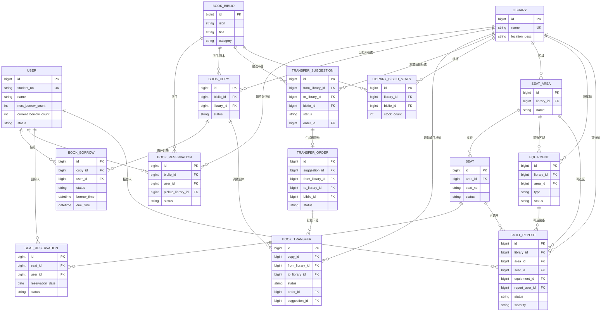

# 论文用：数据库概述、表纳入分析与 E-R 图

本文档依据项目根目录 **`数据库结构.md`**、**`database_backup.sql`**（示例库 `library_db`）、以及源码中 **`src/main/java/com/library/entity/*.java`** 的 `@TableName` 声明整理，供学位论文「数据库设计 / 概念结构设计」章节引用与裁剪。

---

## 1. 本项目数据库部分（概述）

系统采用 **MySQL** 关系型数据库，库名在备份脚本中为 **`library_db`**（部署时可变更）。数据表均以 **`tb_`** 为前缀，围绕以下业务域组织：

| 业务域 | 主要表 | 说明 |
|--------|--------|------|
| 用户与馆 | `tb_user`、`tb_library` | 读者/馆员属性、分馆信息；用户可关联常用馆 |
| 书目与馆藏 | `tb_book_biblio`、`tb_book_copy`、`tb_library_biblio_stats` | 书目元数据、可流通副本、按馆+书目的统计快照（支撑智能体/策略决策） |
| 借阅与预约 | `tb_book_borrow`、`tb_book_reservation` | 借还流水、无库存时的预约排队 |
| 跨馆调拨 | `tb_book_transfer`、`tb_transfer_suggestion`、`tb_transfer_order` | 调拨执行记录、主动调拨建议与批量调拨单 |
| 座位 | `tb_seat_area`、`tb_seat`、`tb_seat_reservation` | 区域—座位—预约 |
| 设备与故障 | `tb_equipment`、`tb_fault_report` | 馆内设备；统一工单（馆/区/座/设备多目标） |
| 辅助与历史 | `tb_repair_ticket`、`tb_notification`、`tb_notification_template`、`tb_negotiation_log` | 旧版设备报修、通知投递、协商/任务日志等 |

**与 `database_backup.sql` 的差异说明**：备份脚本为某一时间点的结构快照；增量脚本（如 `database_fault_report.sql`、`database_transfer_order.sql`、`add_transfer_fields.sql` 等）在 `数据库结构.md` 中描述得更完整（例如借阅表上的取书截止时间、`tb_book_transfer` 与建议/调拨单的关联字段等）。论文中宜以 **`数据库结构.md` 为逻辑真值**，以 SQL 脚本为物理实现参考。

---

## 2. 基于 E-R 与核心功能的表纳入分析

**核心功能界定**（与论文主线一致）：多馆协同下的 **智能借还 / 跨馆调拨 / 预约与库存决策**、**座位预约**、**故障报修与资源不可用联动**。辅助功能若单独展开会冲淡主题，宜在正文中省略或附录一笔带过。

### 2.1 建议纳入论文概念结构 / 逻辑结构的核心实体（表）

| 表名 | 纳入理由 |
|------|-----------|
| `tb_user` | 借阅、预约、报修等行为的主体 |
| `tb_library` | 多馆场景的空间与业务边界 |
| `tb_book_biblio` | 书目层逻辑实体（ISBN、题名等） |
| `tb_book_copy` | 物理流通单元，连接书目、所在馆与借还 |
| `tb_book_borrow` | 借还状态机与跨馆取书等核心流水 |
| `tb_book_reservation` | 无库存预约策略与队列 |
| `tb_book_transfer` | 跨馆物理调拨执行记录 |
| `tb_transfer_suggestion`、`tb_transfer_order` | 主动调拨建议—调拨单—多条调拨记录的链路，体现「智能体/管理策略」与执行分离 |
| `tb_library_biblio_stats` | 馆藏书目级统计，支撑 CFP/评分等决策（可作为**派生/快照**实体在文中说明） |
| `tb_seat_area`、`tb_seat`、`tb_seat_reservation` | 座位资源与预约闭环 |
| `tb_equipment`、`tb_fault_report` | 设备资产与统一故障工单（与选座、资源排除规则相关） |

### 2.2 建议不纳入正文 E-R 主图（可脚注或附录说明）

| 表名 | 不纳入主图的理由 |
|------|------------------|
| `tb_notification`、`tb_notification_template` | 属于消息投递基础设施，与「图书馆业务核心 E-R」弱相关；论文篇幅有限时通常省略 |
| `tb_repair_ticket` | 文档与代码均表明已由 **`tb_fault_report`** 统一承接多维报修；旧表仅兼容/历史，主图保留一张工单实体即可 |
| `tb_negotiation_log`（若库中存在） | 偏 **多智能体过程审计/日志**，可放在「系统实现」而非概念 E-R；若需体现协商，可用文字说明 + 与 `request_id`/`tb_book_transfer` 的逻辑关联，而不必在主图展开所有属性 |

### 2.3 可选：在「预约」小节一笔带过的字段

- `tb_book_reservation.notification_sent` 等：实现层标记，不必作为独立实体出现在 E-R 主图中。

---

## 3. 实体-关系图（Mermaid）

下图仅包含 **2.1 节纳入核心** 的实体及主要联系（基数为概念层近似；物理库中外键与可空约束以实现为准）。若需导入支持 Mermaid 的编辑器（Typora、VS Code、GitHub 等），直接使用下方代码块即可。

> **说明**：`LIBRARY` 与 `BOOK_TRANSFER` 之间存在 **源馆、目标馆** 两类关联；Mermaid `erDiagram` 对同一对实体重复连线在部分渲染器上可能合并显示，故图中用 **`BOOK_TRANSFER`** 内隐式两个指向馆的 FK 表达，正文中可配合文字写清 **from / to**。

---

## 4. 维护说明

- 若数据库后续增减表或字段，请同步更新 **`数据库结构.md`** 与本文件中的 **第 1～2 节** 及 **Mermaid 图**。
- 论文排版若要求「E-R 图单独一页」，可将第 3 节代码块复制到支持 Mermaid 的排版工具中导出为 PDF/SVG。
